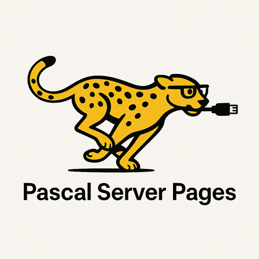

  

### **📁 Pascal Server Pages (PSP)**

**Framework | Object Pascal | Delphi-Based | With DWS! (Delphi Web Script)**

> *A lightweight, no-nonsense web framework for building fast, minimal, and stateful web applications using Delphi Pascal.*

**Pascal Server Pages (PSP)** is a retro-inspired, modern-executing server-side scripting framework built in Object Pascal. Designed for speed, predictability, and minimal dependencies, PSP allows developers to build full HTML5 web apps *without* JavaScript or CSS. Think PHP circa 2004 — but rebuilt in Pascal, with clean syntax and actual type safety.

#### 🧠 Features:

* `<% %>` inline code execution with optional external `.pas` files
* DWS scripting integration for dynamic logic
* Support for CGI and standalone HTTP server modes
* Clean separation between presentation and logic
* Deliberately dated aesthetic and structure for full “forgotten university IT department” vibes

#### 🔒 Use Cases:

* Internal portals
* Lightweight dashboards
* Legacy-style support ticket systems
* FTP-style web frontends
* Anything that doesn’t need React. Ever.

> *"It just works. And it’s weirdly fast."*
